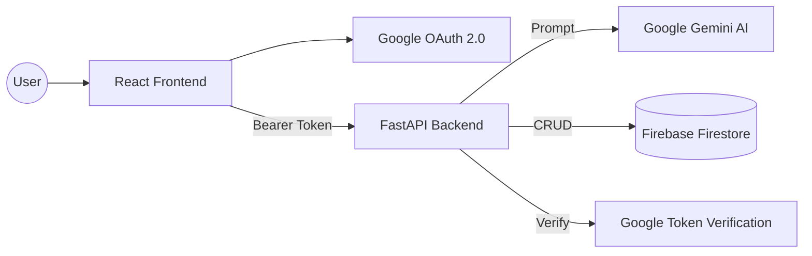

# 👾 AI Expense Tracker

[](https://reactjs.org/)
[](https://fastapi.tiangolo.com/)
[](https://ai.google.dev/)
[](https://firebase.google.com/)
[](https://cloud.google.com/run)

A sophisticated, AI-enhanced expense management system that leverages Natural Language Processing (NLP) to simplify financial tracking. Features a unique **Pixel Art (8-bit) aesthetic** for a nostalgic yet modern user experience.

🔗 **Live API Demo**: [https://ai-expense-tracker-651073678330.asia-northeast1.run.app/docs](https://ai-expense-tracker-651073678330.asia-northeast1.run.app/docs)

---

## 🌟 Key Features

- **🤖 AI Natural Language Processing**: Just type "I spent 15 dollars on coffee this morning" and the Gemini-powered engine automatically extracts the amount, category, and date.
- **🔐 Secure OAuth 2.0 Integration**: Enterprise-grade authentication using Google Identity Services for seamless and secure user login.
- **📺 Retro Pixel Art UI**: A custom-designed "8-bit" interface built with CSS-in-JS and modern React components, providing a standout visual identity.
- **📊 Personalized Analysis**: Intelligent categorization and expense breakdown based on user-defined labels and preferences.
- **☁️ Cloud-Native Architecture**: Fully containerized backend optimized for Google Cloud Run's serverless infrastructure.

---

## 🛠️ Technical Stack

### **Frontend**
- **Library**: React 18 (Vite-powered for high-performance builds)
- **State Management**: React Hooks & Context API
- **Authentication**: `@react-oauth/google` (Google Identity Services)
- **Styling**: Vanilla CSS with a Custom Pixel-Art Design System
- **HTTP Client**: Axios with interceptors for JWT/Bearer token management

### **Backend**
- **Framework**: FastAPI (High-performance Python 3.10+ framework)
- **AI Engine**: Google Generative AI (Gemini Pro) for NLP parsing
- **Database**: Google Firebase Firestore (NoSQL for real-time data persistence)
- **Security**: Google OAuth 2.0 Token Verification (ID Token validation)
- **Deployment**: Dockerized & Hosted on **Google Cloud Run**

---

## 🏗️ Architecture



---

## 🚀 Local Development

### Prerequisites
- Python 3.10+
- Node.js 18+
- Google Cloud Project (for Gemini & OAuth)
- Firebase Project (for Firestore)

### 1. Backend Setup
```bash
cd backend
pip install -r requirements.txt
# Create a .env file with your GEMINI_API_KEY, GOOGLE_CLIENT_ID, and FIREBASE_CONFIG
python -m uvicorn app.main:app --reload
```

### 2. Frontend Setup
```bash
cd frontend
npm install
# Create a .env file with VITE_API_URL and VITE_GOOGLE_CLIENT_ID
npm run dev
```

---

## 📝 Environment Variables

Required variables for full functionality:

| Variable | Description |
| :--- | :--- |
| `GOOGLE_CLIENT_ID` | Google OAuth 2.0 Client ID |
| `FIREBASE_CONFIG` | Firestore service account configuration (JSON) |
| `GEMINI_API_KEY` | Google AI Studio API Key |
| `VITE_API_URL` | Backend API Endpoint URL |

---

## 👨‍💻 Author

Built with ❤️ by **CHIEN YU-HSUAN (カン　ユウケン)**

*This project was developed as a demonstration of integrating Generative AI into full-stack web applications with professional-grade cloud infrastructure.*

