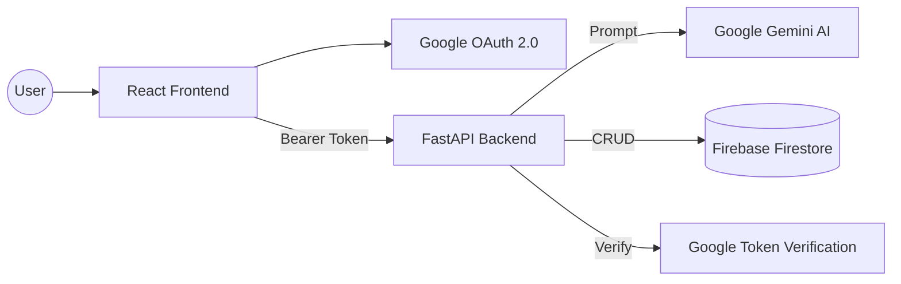

# 👾 AI Expense Tracker

[](https://reactjs.org/)
[](https://fastapi.tiangolo.com/)
[](https://ai.google.dev/)
[](https://firebase.google.com/)
[](https://cloud.google.com/run)

A sophisticated, AI-enhanced expense management system that leverages Natural Language Processing (NLP) to simplify financial tracking. Features a unique **Pixel Art (8-bit) aesthetic** for a nostalgic yet modern user experience.

🔗 **Live API Demo**: [https://ai-expense-tracker-651073678330.asia-northeast1.run.app/docs](https://ai-expense-tracker-651073678330.asia-northeast1.run.app/docs)

---

## 🌟 Key Features

- **🤖 AI Natural Language Processing**: Just type "I spent 15 dollars on coffee this morning" and the Gemini-powered engine automatically extracts the amount, category, and date.
- **🔐 Secure OAuth 2.0 Integration**: Enterprise-grade authentication using Google Identity Services for seamless and secure user login.
- **📺 Retro Pixel Art UI**: A custom-designed "8-bit" interface built with CSS-in-JS and modern React components, providing a standout visual identity.
- **📊 Personalized Analysis**: Intelligent categorization and expense breakdown based on user-defined labels and preferences.
- **☁️ Cloud-Native Architecture**: Fully containerized backend optimized for Google Cloud Run's serverless infrastructure.

---

## 🛠️ Technical Stack

### **Frontend**
- **Library**: React 18 (Vite-powered for high-performance builds)
- **State Management**: React Hooks & Context API
- **Authentication**: `@react-oauth/google` (Google Identity Services)
- **Styling**: Vanilla CSS with a Custom Pixel-Art Design System
- **HTTP Client**: Axios with interceptors for JWT/Bearer token management

### **Backend**
- **Framework**: FastAPI (High-performance Python 3.10+ framework)
- **AI Engine**: Google Generative AI (Gemini Pro) for NLP parsing
- **Database**: Google Firebase Firestore (NoSQL for real-time data persistence)
- **Security**: Google OAuth 2.0 Token Verification (ID Token validation)
- **Deployment**: Dockerized & Hosted on **Google Cloud Run**

---

## 🏗️ Architecture



---

## 🌐 Deployment

The application is fully deployed and accessible in a production-ready environment:

- **Frontend**: [https://ai-expense-tracker-1a695.web.app/](https://ai-expense-tracker-1a695.web.app/) (Hosted on **Firebase Hosting**)
- **Backend API**: [https://ai-expense-tracker-651073678330.asia-northeast1.run.app](https://ai-expense-tracker-651073678330.asia-northeast1.run.app) (Hosted on **Google Cloud Run**)
- **API Documentation**: [/docs](https://ai-expense-tracker-651073678330.asia-northeast1.run.app/docs) (Swagger UI)

---

## 🚀 Local Development & Testing

### Prerequisites
- **Python 3.10+** & **Node.js 18+**
- **Google Cloud Project**: Enabled Gemini API and OAuth 2.0.
- **Firebase Project**: Firestore database initialized.

### 1. Backend Setup & Testing
```bash
# Navigate to backend directory
cd backend

# Install dependencies
pip install -r requirements.txt

# Environment Setup
# Create a .env file based on .env.example
# Ensure GOOGLE_CLIENT_ID, GEMINI_API_KEY, and FIREBASE credentials are set

# Run the FastAPI server
python -m uvicorn app.main:app --reload --port 8000
```
**Testing the API**:
- Open `http://localhost:8000/docs` to access the interactive Swagger documentation.
- Use the `/auth/google` endpoint with a valid Google ID token to verify authentication.
- Test the `/parse_expense` endpoint by providing natural language text.

### 2. Frontend Setup & Testing
```bash
# Navigate to frontend directory
cd frontend

# Install dependencies
npm install

# Environment Setup
# Create a .env file with VITE_API_URL=http://localhost:8000
# and VITE_GOOGLE_CLIENT_ID

# Run the development server
npm run dev
```
**Testing the Web App**:
- Access `http://localhost:5173`.
- **Login**: Use your Google account (ensure the authorized redirect URIs in Google Cloud Console include localhost).
- **Expense Entry**: Try typing "Bought groceries for $50" in the entry box.
- **Validation**: Verify that the AI correctly parses the amount and category, and that it persists to Firestore correctly.

---

## 📝 Environment Variables

Highly sensitive keys must be configured in your environment or `.env` files:

### Backend (`/backend/.env`)
| Variable | Description |
| :--- | :--- |
| `GOOGLE_CLIENT_ID` | OAuth 2.0 Client ID for token verification |
| `GEMINI_API_KEY` | API Key from Google AI Studio |
| `TYPE`, `PROJECT_ID`, etc. | Firebase Admin SDK service account credentials |

### Frontend (`/frontend/.env`)
| Variable | Description |
| :--- | :--- |
| `VITE_API_URL` | Base URL of your backend (Local: `http://localhost:8000`) |
| `VITE_GOOGLE_CLIENT_ID` | Must match the Backend's Client ID |

---

## 📂 Project Structure
```text
.
├── backend/            # FastAPI source code
│   ├── app/            # Main application logic
│   │   ├── core/       # AI parsing & Database logic
│   │   └── main.py     # API entry point & routes
│   └── Dockerfile      # Container configuration
├── frontend/           # React + Vite source code
│   ├── src/
│   │   ├── components/ # Pixel Art UI components
│   │   └── services/   # API & Auth services
│   └── firebase.json   # Hosting configuration
└── scripts/            # Utility scripts for data/deployment
```

---

## 👨‍💻 Author

Built with ❤️ by **CHIEN YU-HSUAN (カン　ユウケン)**

*This project was developed as a demonstration of integrating Generative AI into full-stack web applications with professional-grade cloud infrastructure.*

